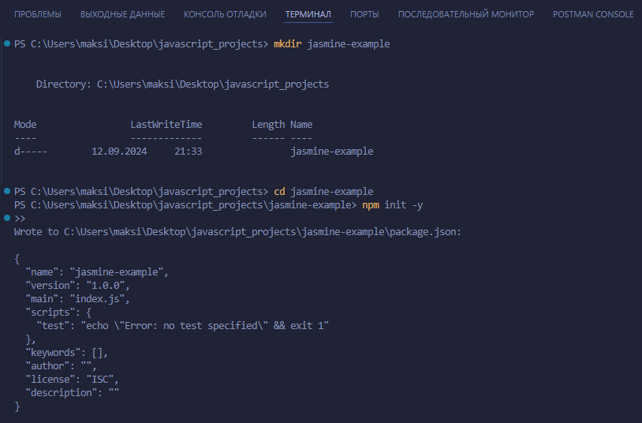
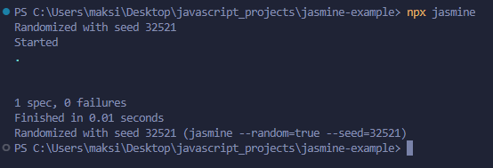

# Тестирования кода на Jasmine


### Шаг 1: Инициализация проекта

**Создайте новую папку для проекта и перейдите в неё:**

```bash
mkdir jasmine-example
cd jasmine-example
```

**Инициализируйте проект npm:**

```bash
npm init -y
```

**Установите Jasmine:**

```bash
npm install --save-dev jasmine
```

**Инициализируйте Jasmine в проекте:**

```bash
npx jasmine init
```

Эта команда создаст базовую конфигурацию `Jasmine`, папку spec для тестов и файл `jasmine.json` для настроек.



### Шаг 2: Создание тестируемой функции

**Создайте файл `add.js` в корне проекта с простой функцией сложения:**

```js
// add.js
function add(a, b) {
  return a + b;
}

module.exports = add;
```

### Шаг 3: Написание тестов

**Создайте папку `spec` и файл теста `add.spec.js` внутри неё:**

```bash
mkdir spec
touch spec/add.spec.js
```

**Добавьте в файл `spec/add.spec.js` следующий код:**

```js
// spec/add.spec.js
const add = require('../add');

describe('Функция add', () => {
  it('должна возвращать сумму двух чисел', () => {
    expect(add(1, 2)).toBe(3);
    expect(add(-1, -1)).toBe(-2);
    expect(add(0, 0)).toBe(0);
    expect(add(1, -1)).toBe(0);
  });
});
```

### Шаг 4: Запуск тестов

**Теперь вы можете запустить тесты с помощью команды:**

```bash
npx jasmine
```

Jasmine выполнит тесты и выведет результаты в консоли.



```
Ваши тесты успешно прошли, и Jasmine сообщил, что:

- Выполнен 1 тест.
- Ошибок нет.
- Время выполнения тестов составило 0.01 секунды.

Это значит, что функция сложения работает корректно, и тесты настроены правильно.

Если вы хотите добавить больше тестов или функций для тестирования, вы можете просто расширить папку spec и добавлять новые тестовые файлы.

Также, если необходимо включить более сложные сценарии, вы можете настроить Jasmine с помощью файла jasmine.json или добавить другие тестовые фреймворки для совместного использования с Jasmine.
```

### Структура проекта

Ваш проект должен выглядеть следующим образом:

```
jasmine-example/
│
├── node_modules/           # Зависимости
├── add.js                  # Тестируемая функция
├── package.json            # Файл конфигурации npm
├── spec/                   # Папка для тестов
│   └── add.spec.js         # Тесты для функции сложения
│
└── jasmine.json            # Конфигурация Jasmine
```

Теперь у вас есть базовый проект с Jasmine, который можно расширять и использовать для тестирования других функций.


**Преподаватель:** Дуплей Максим Игоревич

**Дата:** 12.09.2024

**Версия 1.0**